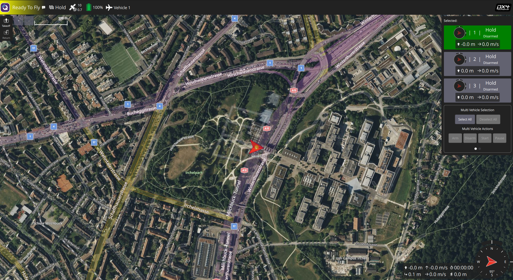

# PX4 三機編隊 SITL

本專案提供一個可重現的 PX4 三機軟體在迴路（SITL）展示：MAV1 作為 leader，MAV2 與 MAV3 分別作為左右 follower。透過 ROS 2 terminal console，可完成三機起飛、leader 移動、VEE／橫隊切換、follower 跟隨及降落。



[觀看三機編隊展示影片](assets/demo/three-vehicle-formation-demo.mp4)

> 此專案僅驗證 SITL；不可將本 README 的流程視為實機飛行程序。

## 系統架構

```text
QGroundControl（必要：GCS heartbeat 與監看；不發送控制命令）
                              │ MAVLink
Gazebo ← PX4 SITL × 3 ← Micro XRCE-DDS Agent ← ROS 2 swarm nodes ← operator_console
```

`operator_console` 是唯一支援的控制入口。它呼叫 ROS 2 actions，再由 swarm nodes 對 PX4 發送 Offboard setpoint；QGroundControl（QGC）只用來維持三台 PX4 的 GCS 連線健康狀態及觀察 telemetry。

## 已驗證環境與版本

| 項目 | 固定版本／條件 |
| --- | --- |
| Host OS | Ubuntu 24.04 LTS（唯一已驗證平台） |
| 圖形介面 | X11 |
| Container | Docker Engine 與 Docker Compose |
| ROS 2 | Jazzy |
| Container base image | Ubuntu 24.04 |
| PX4-Autopilot | `v1.17.0`，`d6f12ad1c4f70ad3230afd7d86e971421e02fef4` |
| `px4_msgs` | `86d8239e962f6939e05c3737784f60c02fa884db` |
| Micro XRCE-DDS Agent | `v2.4.3`（由 Docker image 建置） |
| QGroundControl | `v5.0.8` x86_64 AppImage |

macOS、Windows、Docker Desktop，以及非 X11 的桌面環境均未驗證。

## 前置條件

在 Ubuntu host 安裝 Git、Docker Engine、Docker Compose plugin 與 X11。QGC 必須安裝在 **host**，不要放進本專案 container。

### 安裝 QGroundControl（host）

以下依 QGC v5.0.8 Linux x86_64 AppImage 流程安裝。若 host 缺少 AppImage 相依套件，先執行：

```bash
sudo apt install -y libfuse2 libxcb-xinerama0 libxkbcommon-x11-0 libxcb-cursor0
```

下載並啟動 QGC：

```bash
mkdir -p ~/Applications/QGroundControl
cd ~/Applications/QGroundControl
wget -O QGroundControl-x86_64.AppImage \
  https://github.com/mavlink/qgroundcontrol/releases/download/v5.0.8/QGroundControl-x86_64.AppImage
chmod +x QGroundControl-x86_64.AppImage
./QGroundControl-x86_64.AppImage
```

## 取得原始碼

Docker build context 要求 `PX4-Autopilot/` 位於本 repo 根目錄內。先建立父資料夾，再依下列結構取得原始碼：

```text
px4-swarm-sitl/
└── docker_ubuntu24/
    ├── PX4-Autopilot/
    └── px4_ws/src/px4_msgs/
```

```bash
mkdir -p ~/px4-swarm-sitl
cd ~/px4-swarm-sitl

git clone --branch sitl-dev --single-branch \
  https://github.com/yuanyifan0625/px4-swarm-control.git docker_ubuntu24
cd docker_ubuntu24

git clone https://github.com/PX4/PX4-Autopilot.git PX4-Autopilot
git -C PX4-Autopilot checkout d6f12ad1c4f70ad3230afd7d86e971421e02fef4

git clone https://github.com/PX4/px4_msgs.git px4_ws/src/px4_msgs
git -C px4_ws/src/px4_msgs checkout 86d8239e962f6939e05c3737784f60c02fa884db
```

## 建置 container 與 workspace

在 **host** 的 repo 根目錄執行。`xhost` 允許 container 顯示 Gazebo 視窗；結束後會在 cleanup 步驟撤銷此權限。

```bash
xhost +local:docker
docker compose build
docker compose up -d
docker compose exec ros2_jazzy bash
```

以下命令皆在 container 內執行。

### 建置 PX4 SITL

```bash
cd /home/ncrl/docker_ubuntu24/PX4-Autopilot
make px4_sitl gz_x500
```

首次執行會建置 PX4 與下載／準備 Gazebo 資源，並啟動單機 simulator。確認 build 完成後，以 `Ctrl+C` 停止這次單機 simulator，再依下一節啟動固定三機流程。

### 建置 ROS 2 packages

```bash
cd /home/ncrl/docker_ubuntu24/px4_ws
source /opt/ros/jazzy/setup.bash
colcon build --packages-select px4_msgs px4_swarm_interfaces px4_swarm_control
source install/setup.bash
```

## 執行三機編隊 demo

請開啟六個 container terminal 與一個 host terminal。所有 container terminal 都先進入：

```bash
docker compose exec ros2_jazzy bash
```

### Terminal 1：Micro XRCE-DDS Agent

```bash
MicroXRCEAgent udp4 -p 8888
```

### Host terminal：啟動並確認 QGroundControl

啟動前面安裝的 QGC，等待右側 vehicle list 出現 **Vehicle 1、Vehicle 2、Vehicle 3**，且三台都顯示已連線／可飛狀態。QGC 必須在整個 demo 期間保持開啟，以避免 `Preflight Fail: No connection to the GCS`。

> 不要在 QGC 使用 Arm、Takeoff、Land、mode switch、mission 或 waypoint。這些控制會與 ROS 2 Offboard 流程衝突。

### Terminal 2–4：依序啟動三台 PX4 SITL

三條命令均在 `/home/ncrl/docker_ubuntu24/PX4-Autopilot` 執行。第一台會啟動 Gazebo；第二、三台加入既有 world。

```bash
GZ_IP=127.0.0.1 PX4_GZ_NO_FOLLOW=1 PX4_UXRCE_DDS_NS=MAV1 PX4_SYS_AUTOSTART=4001 PX4_SIM_MODEL=gz_x500 ./build/px4_sitl_default/bin/px4 -d -i 0
```

```bash
GZ_IP=127.0.0.1 PX4_GZ_NO_FOLLOW=1 PX4_UXRCE_DDS_NS=MAV2 PX4_GZ_STANDALONE=1 PX4_SYS_AUTOSTART=4001 PX4_GZ_MODEL_POSE='-1,1,0' PX4_SIM_MODEL=gz_x500 ./build/px4_sitl_default/bin/px4 -d -i 1
```

```bash
GZ_IP=127.0.0.1 PX4_GZ_NO_FOLLOW=1 PX4_UXRCE_DDS_NS=MAV3 PX4_GZ_STANDALONE=1 PX4_SYS_AUTOSTART=4001 PX4_GZ_MODEL_POSE='-1,-1,0' PX4_SIM_MODEL=gz_x500 ./build/px4_sitl_default/bin/px4 -d -i 2
```

### Terminal 5：swarm ROS 2 nodes

```bash
cd /home/ncrl/docker_ubuntu24/px4_ws
source /opt/ros/jazzy/setup.bash
source install/setup.bash
ros2 launch px4_swarm_control swarm_nodes.launch.py
```

### Terminal 6：operator console

```bash
cd /home/ncrl/docker_ubuntu24/px4_ws
source /opt/ros/jazzy/setup.bash
source install/setup.bash
export ROS_DOMAIN_ID=42
ros2 run px4_swarm_control operator_console
```

在 `swarm>` 輸入下列命令：

| 指令 | 功能 |
| --- | --- |
| `1` | 三機起飛並進入 VEE staging |
| `2` / `x` | leader 向 East / West 移動 1 m |
| `3` / `y` | leader 向 North / South 移動 1 m |
| `4` / `z` | leader 上升 / 下降 1 m |
| `5` / `c` | leader yaw 增加 / 減少 30° |
| `6` | 切換 VEE 隊形 |
| `7` | 切換橫隊（line abreast） |
| `settle` | 等待 follower 穩定收斂到目前隊形 |
| `8` | 三機降落 |
| `s`、`p`、`r` | 顯示狀態、暫停、恢復 |

建議驗收順序：`1` → `2` → `3` → `7` → `6` → `8`。Gazebo 中 MAV2、MAV3 應持續依 leader yaw 維持左右 follower slot。

## 驗證與座標注意事項

確認 DDS topic 持續更新：

```bash
ros2 topic echo --once /MAV1/status
ros2 topic echo --once /MAV2/status
ros2 topic echo --once /MAV3/status
ros2 topic echo --once /MAV1/fmu/out/vehicle_local_position_v1
```

控制器使用 Gazebo 共用 ENU world frame（East、North、Up）；PX4 telemetry 則是每機各自的 local-NED origin。請勿把 MAV1、MAV2、MAV3 的 raw local `x/y/z` 當作同一個物理座標系。

## 常見問題

| 現象 | 處理方式 |
| --- | --- |
| `Preflight Fail: No connection to the GCS` | 確認 QGC 仍開啟，且 QGC vehicle list 顯示三台 PX4 都已連線。 |
| 沒有 Gazebo 視窗 | 在 host 重做 `xhost +local:docker`，確認 `DISPLAY` 有值後重啟 container。 |
| console 說 leader status unavailable | 確認 Agent、三台 PX4 與 `swarm_nodes.launch.py` 都已啟動，並確認 `ROS_DOMAIN_ID=42`。 |
| follower 未跟隨 | 先用 `s` 確認三台狀態；不要直接用 QGC 控制飛機。 |

## Cleanup

停止 console、ROS nodes、三個 PX4、Agent 與 Gazebo 後，在 container 確認沒有殘留程序：

```bash
pgrep -af '[M]icroXRCEAgent|[b]uild/px4_sitl_default/bin/px4|[g]z sim|[g]zserver' || true
pgrep -af '[v]ehicle_node|[g]round_station_node|[o]perator_console' || true
```

回到 host 撤銷 X11 權限：

```bash
xhost -local:docker
docker compose down
```

## 專案 packages 與程式模組

### 自製 ROS 2 packages

| Package | 功能 |
| --- | --- |
| `px4_swarm_interfaces` | 定義三機任務所需的 ROS 2 actions 與 messages，將 operator、ground station 與 vehicle nodes 的通訊契約固定下來。 |
| `px4_swarm_control` | 實作三機起降、leader 控制、follower 編隊、安全保護、PX4 DDS bridge 與 terminal 操作介面。 |

### `px4_swarm_control` Python 模組

| 模組 | 一句話功能 |
| --- | --- |
| `bridge_config.py` | 固定三台 MAV 的 namespace、target system 與 PX4／`px4_msgs` 相容性契約。 |
| `collision_safety_gate.py` | 在機間距離不安全時阻擋新目標並維持最後安全 setpoint。 |
| `follower_controller.py` | 根據 leader 狀態與隊形 slot 計算 follower 目標。 |
| `frame_transform.py` | 在 Gazebo ENU world frame 與各機 PX4 local-NED frame 間轉換。 |
| `geometry.py` | 計算 VEE 與橫隊的 body-frame offset 和幾何關係。 |
| `ground_station_node.py` | 協調 swarm actions、staging、隊形切換、暫停與降落任務。 |
| `live_bridge_smoke.py` | 檢查實際 DDS bridge topic 與 PX4 v1.17 SITL contract。 |
| `models.py` | 定義控制流程使用的列舉、狀態與 setpoint 資料模型。 |
| `operation_profile.py` | 集中保存小場地 SITL demo 的固定高度、間距與容差。 |
| `operator_console.py` | 將短終端指令轉換成既有 ROS 2 swarm actions。 |
| `package_info.py` | 集中保存 package 暴露的 ROS 介面與三機 namespace 資訊。 |
| `px4_compatibility.py` | 比對 pinned PX4 與 `px4_msgs` 的 message 定義和 source commit。 |
| `px4_speed_profile.py` | 產生、檢查與套用 PX4 runtime speed parameter profile。 |
| `px4_vehicle_interface.py` | 封裝單台 PX4 的 DDS publisher、subscriber、Offboard heartbeat 與 vehicle command。 |
| `vehicle_node.py` | 執行每台機的起飛狀態機、leader／follower 控制與 landing 行為。 |
